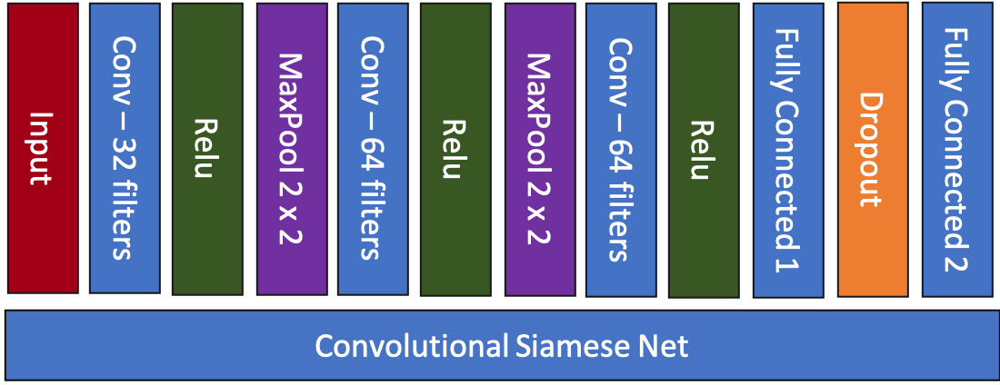

# Siamese Convolutional Neural Networks for Authorship Verification

This project is meant to provide a reference implementation of the siamese network architecture described [in this paper](http://cs231n.stanford.edu/reports/2017/pdfs/801.pdf), as well as provide a novel re-organizing and pre-processing method for the [IAM handwriting dataset](http://www.fki.inf.unibe.ch/databases/iam-handwriting-database). It was was completed as the final project for CU Boulder CSCI 5922: Neural Networks and Deep Learning.

Project Collaborators:
- Lawrence Hessburg (lawrence.hessburgiv@colorado.edu)
- Poorwa Hirve (poorwa.hirve@colorado.edu)
- Prathyusha Gayam (prathyusha.gayam@colorado.edu)
- Payoj Jain (payoj.jain@colorado.edu)

To get started training and testing the network yourself right away, jump to the [How to run](#how-to-run) section

## Overview
A Siamese Neural Network is a class of neural network architectures that contain two or more identical sub networks. 'Identical' here means that they have the same configuration with the same parameters and weights. Parameter updating
is mirrored across both sub networks. It is used to find the similarity of the inputs by comparing its feature vectors.

As an application, we have implemented a Siamese convolutional neural network to determine whether two pieces of handwritten documents are written by the same author or not. While implementing this project, we faces a lot of challenges from organising the dataset to building a model which performs really well for our problem statement. Among all the architectures we tries and trained, ResNetSiamese performed the best. 

We also tested fake handwritten generated images, which were generated using Cycle GANs, with the real ones on our model and learned that with more images our model will certainly perform well in differentiating fake from real ones.

## Network Architectures
If we talk about basic network structure, two inputs (image A and image B) are fed as inputs to two identical CNNs. The output encodings from these two images are then concatenated, which is then fed to a fully connected layer to get the class scores.
We concatenate to get the following vector, expanding an $n$ output to $4n$:
$$ v = [\quad a \qquad b \qquad a - b \qquad a \odot b \quad]$$
This is then fed to a fully connected layer, followed by a softmax layer.

### Baseline

This identical network of the Siamese CNN consists of:
1. Conv layer with 32 filters, followed by ReLU and MaxPool 2x2
2. Conv layer with 64 filters, followed by ReLU and MaxPool 2x2
3. Conv layer with 64 filters, followed by ReLU
4. Fully connected layer with 400 hidden units
5. Dropout with probability = 0.5
6. Fully connected layer with 200 hidden units
7. L2 Regularization

### ResNet

This consists of tiny blocks consisting of:
1. Conv layer
2. Batch normalization
3. ReLU

Once the basic building block is built, the following architecture is created:

1. One ResNet unit with 16 filters 
2. Two ResNet units with filter size 16
3. Two units of filter size 32 with stride 2
4. Two units of size 64 with stride 2
5. Fully connected layer which brings the output to 10 dimensions

## Dataset
We used IAM Handwriting Database (http://www.fki.inf.unibe.ch/databases/iam-handwriting-database) for training and testing. It has various formats for handwritten datasets from 657 writers and 1539 pages of scanned text. The website has not properly specified how they divided the data and which files and folders contain which types of texts written by which author. This was our first challenge that we faced. We have defined the IAM dataset below for future users who may find it difficult to work with this dataset.

### IAM handwriting dataset

### Data Preprocessing

## Results

## How to run

### Prerequisites

### Training

### Validation

## References

- [OfflineSignatureVerification](https://github.com/Aftaab99/OfflineSignatureVerification.git)

- [Signature-verification-using-deep-learning](https://github.com/jadevaibhav/Signature-verification-using-deep-learning.git)

- [Cycle-GAN](https://github.com/junyanz/pytorch-CycleGAN-and-pix2pix.git)

