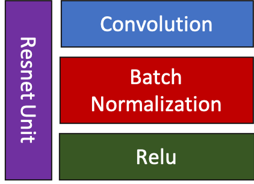

# Siamese Convolutional Neural Networks for Authorship Verification

This project is meant to provide a reference implementation of the siamese network architecture described [in this paper](http://cs231n.stanford.edu/reports/2017/pdfs/801.pdf), as well as provide a novel re-organizing and pre-processing method for the [IAM handwriting dataset](http://www.fki.inf.unibe.ch/databases/iam-handwriting-database). It was was completed as the final project for CU Boulder CSCI 5922: Neural Networks and Deep Learning.

Project Collaborators:
- Lawrence Hessburg (lawrence.hessburgiv@colorado.edu)
- Poorwa Hirve (poorwa.hirve@colorado.edu)
- Prathyusha Gayam (prathyusha.gayam@colorado.edu)
- Payoj Jain (payoj.jain@colorado.edu)

To get started training and testing the network yourself right away, jump to the [How to run](#how-to-run) section

## Overview
A Siamese Neural Network is a class of neural network architectures that contain two or more identical sub networks. 'Identical' here means that they have the same configuration with the same parameters and weights. Parameter updating
is mirrored across both sub networks. It is used to find the similarity of the inputs by comparing its feature vectors.

As an application, we have implemented a Siamese convolutional neural network to determine whether two pieces of handwritten documents are written by the same author or not. While implementing this project, we faces a lot of challenges from organising the dataset to building a model which performs really well for our problem statement. Among all the architectures we tries and trained, ResNetSiamese performed the best. 

We also tested fake handwritten generated images, which were generated using Cycle GANs, with the real ones on our model and learned that with more images our model will certainly perform well in differentiating fake from real ones.

## Network Architectures
If we talk about basic network structure, two inputs (image A and image B) are fed as inputs to two identical CNNs. The output encodings from these two images are then concatenated, which is then fed to a fully connected layer to get the class scores.
We concatenate to get the following vector, expanding an $n$ output to $4n$:
$$ v = [\quad a \qquad b \qquad a - b \qquad a \odot b \quad] $$
This is then fed to a fully connected layer, followed by a softmax layer.

### Baseline

This identical network of the Siamese CNN consists of:
1. Conv layer with 32 filters, followed by ReLU and MaxPool 2x2
2. Conv layer with 64 filters, followed by ReLU and MaxPool 2x2
3. Conv layer with 64 filters, followed by ReLU
4. Fully connected layer with 400 hidden units
5. Dropout with probability = 0.5
6. Fully connected layer with 200 hidden units
7. L2 Regularization

### ResNet

This consists of tiny blocks consisting of:
1. Conv layer
2. Batch normalization
3. ReLU

Once the basic building block is built, the following architecture is created:

1. One ResNet unit with 16 filters 
2. Two ResNet units with filter size 16
3. Two units of filter size 32 with stride 2
4. Two units of size 64 with stride 2
5. Fully connected layer which brings the output to 10 dimensions

## Dataset
We used IAM Handwriting Database (http://www.fki.inf.unibe.ch/databases/iam-handwriting-database) for training and testing. It has various formats for handwritten datasets from 657 writers and 1539 pages of scanned text. The original dataset is not well organized for authorship verification purposes. We have re-organized a subset of the dataset to make author-based tasks mush more efficient. This process is outlined below.

### IAM handwriting dataset

### Data Preprocessing

1. Using `forms.txt` from the [IAM Handwriting Database](http://www.fki.inf.unibe.ch/databases/iam-handwriting-database), download `lines.txt` and get the authors of each file.
- `forms.txt` contains information about each sample: author, sentence, etc.
2. Restructure the dataset into top 100 authors.
- Keep a threshold (we have considered 1000 px) such that we get a significant amount of data, i.e. lines instead of words.
- We do this because ours is a handwriting recognition problem, the more amount of words in the data the better.
- We have stored this data on a public server [Authors.zip](https://transfer.sh/z8FLg/Authors.zip).
    - Download this along with the dependencies by running `./install_dependencies.sh`
3. Once we get the top 100 authors, we generate the training data using `create_pairs.py`. This divides images randomly into pairs.
- author1 author2 1/0 --> `1 if author1 == author2 else 0`
4. We now have our `train.txt` files according to various sizes.
5. Repeat steps 3 and 4, for validation files: `valid.txt` according to various sizes.

Now we have our train-test files according to the data preprocessing steps.

## Results

Our results can be seen in the [results](results) directory. These include graphs and figures from our models. 

To generate a table for accuracy, true positive rate and true negative rate, run test scripts for either of the models.

## How to run

Refer to [Data Preprocessing](#data-preprocessing) for downloading data and dependencies.

### Prerequisites

- Python 3
- [CUDA](https://developer.nvidia.com/cuda-toolkit) and [cuDNN](https://docs.nvidia.com/deeplearning/sdk/cudnn-install/index.html) for training on GPU
- [PyTorch](https://pytorch.org/get-started/locally/) 

All package requirements are in `requirements.txt`and can be installed by running `install_dependencies.sh`
The Authors dataset can be downloaded by running `download_data.sh` in the `Dataset` directory.

### Hyperparameters

In `train.py` there are several hyperparameters available to adjust declared at the top of the script 

- `LEARNING_RATE`:      The initial learning rate for Adam optimization
- `BATCH_SIZE`:         The minibatch size used during training
- `THRESHOLD_VALUE`:    The thresholding level for removing scanning artifacts. In a given input image, any pixel value higher than `THRESHOLD_VALUE` will be set to white.
- `CROP_SIZE`:          The horizontal size to crop input images to. All input images start >= 1000 pixels wide, so `CROP_SIZE` must be < 1000. **NOTE**: Changing this value will require a change to the fully connected layer size of the TinyResnet model. Proceed with caution.
- `RANDOM_CROP`:        Flag determining whether to crop images from a random location, or starting at 0. For example, if the original image is 1500 pixels wide, `CROP_SIZE` is 700 and `RANDOM_CROP` is True, the result will be a 700 pixel wide window of the original image in a random location.
- `DOWNSAMPLE_RATE`:    Downsampling ratio to speed up training. Must be between 0 and 1

### Training

After getting data in the appropriate paths, run train scripts either `train.py` or `trainBaseline.py` with the following flags and arguments:
  - `-c` or `--cuda` to run on GPU
  - `-e EPOCHS`
  - `--load_checkpoint PATH_TO_MODEL_CHECKPOINT`
  - `data_path` path to the .txt file containing training pairs
  - e.g.: `python3 train.py Dataset/train_100.txt -c -e 50`

### Validation

Once the model finishes training, checkpoints will be stored either in the checkpoints directory. You can use them to test using either `test.py` or `testBaseline.py` with the following flags and arguments:
  - `-c` or `--cuda` to run on GPU
  - `-e EPOCHS`
  - `data_path` path to the .txt file containing testing pairs
  - `load_checkpoint` with path to the model checkpoint
  - e.g.: `python3 valid.py Dataset/valid_100.txt Model_Checkpoints/epoch20 -c`

## References

- [Siamese Convolutional Neural Networks for Authorship Verification](http://cs231n.stanford.edu/reports/2017/pdfs/801.pdf)

- [OfflineSignatureVerification](https://github.com/Aftaab99/OfflineSignatureVerification.git)

- [Signature-verification-using-deep-learning](https://github.com/jadevaibhav/Signature-verification-using-deep-learning.git)

- [Cycle-GAN](https://github.com/junyanz/pytorch-CycleGAN-and-pix2pix.git)

- [IAM handwriting database](http://www.fki.inf.unibe.ch/databases/iam-handwriting-database)

